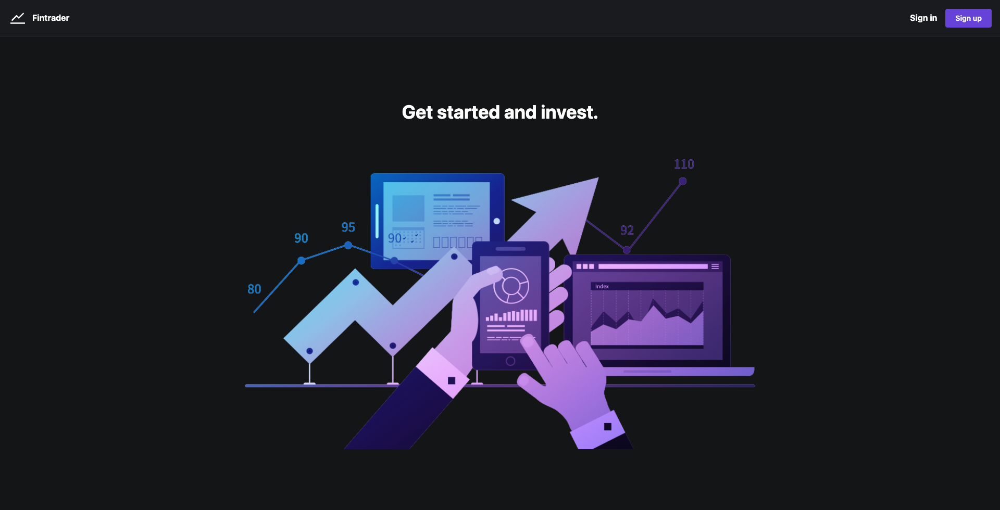
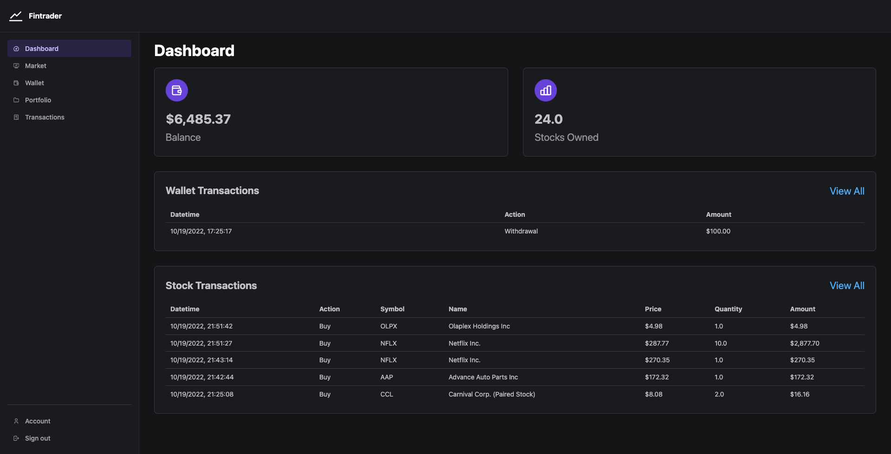
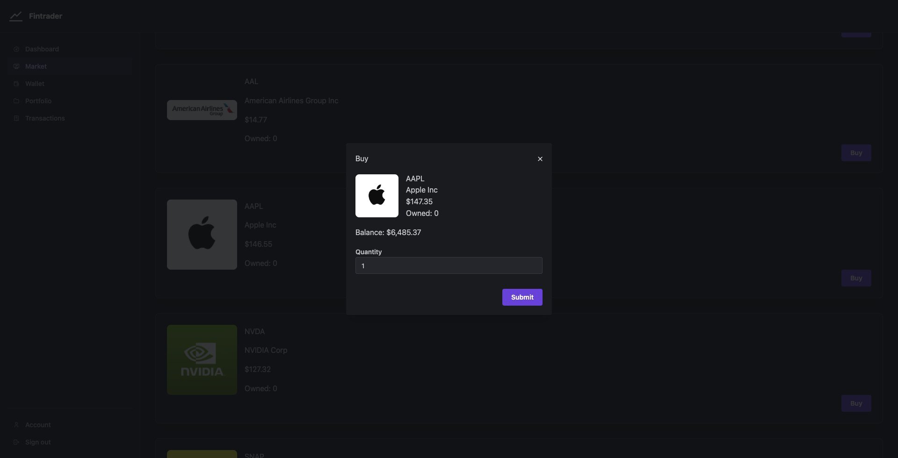
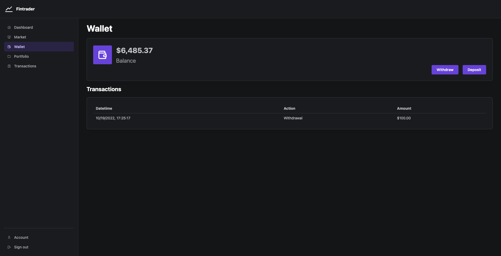
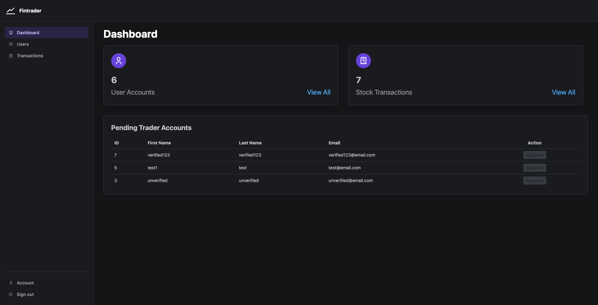
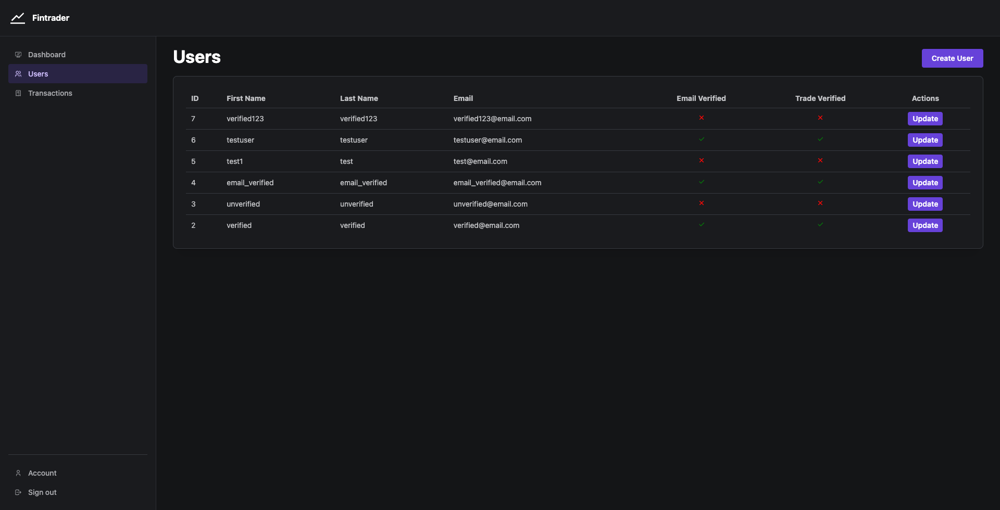
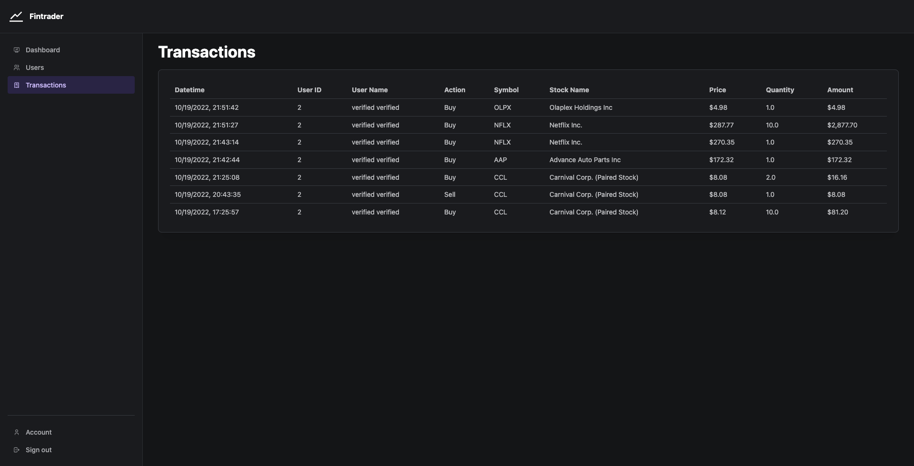
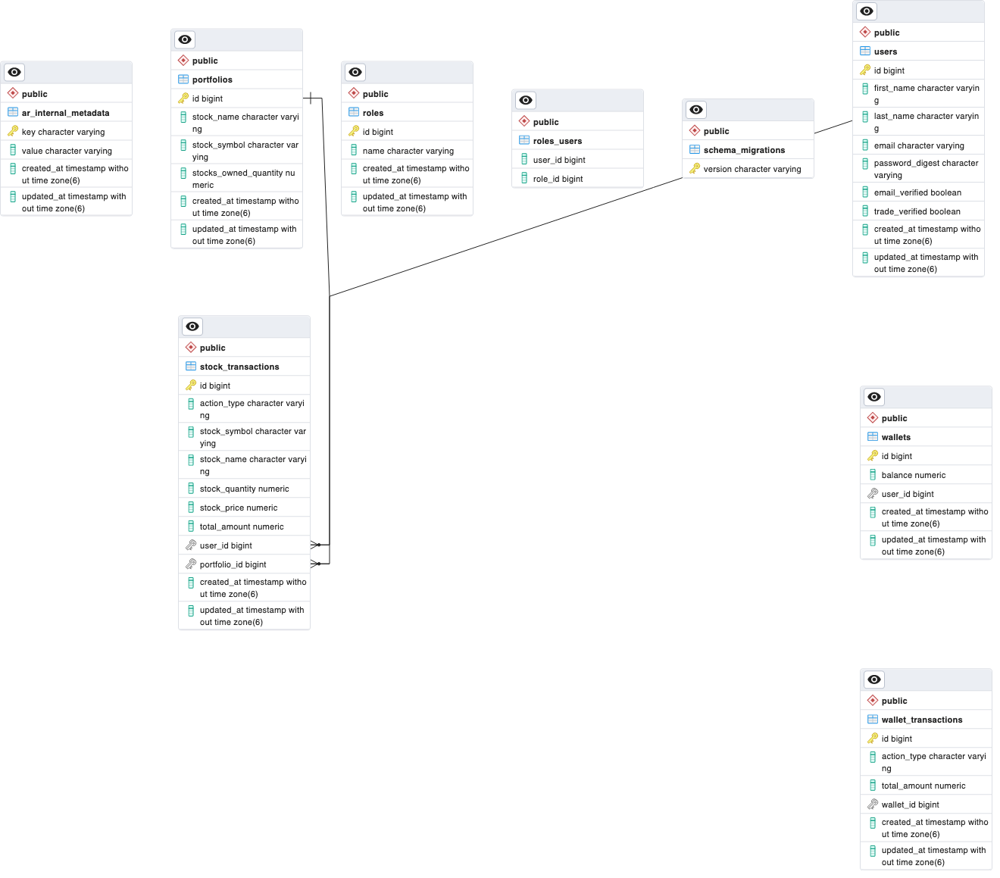

# react-stock-trading-app

This project is an application that allows users to buy and sell stocks.

## Tech Stack

- Ruby on Rails
- React
- IEX Cloud API

## Features

### Trader

- Create an account to buy and sell stocks.
- Receive an email to confirm pending account signup.
- Receive an approval email to notify me once account has been approved as trader.
- Buy stocks and update user portfolio.
- Sell stocks and update user portfolio.
- View all stocks transactions made by buying and selling stocks.
- Withdraw money from user wallet.
- Deposit money to user wallet.
- View all wallet transactions made.

### Admin

- Create a new trader.
- View all traders.
- Edit a specific trader to update account details.
- Approve a trader so that user can start buying and selling stocks.
- View all the transactions made by users.

## ERD

## Test Accounts

- `email: admin@email.com`  
  `password: #x9xNb7vMR5*`

- `email: verified@email.com`  
  `password: Cni9Gu9gAZ8&`

- `email: unverified@email.com`  
  `password: R2W0c$#!v48K`

- `email: email_verified@email.com`  
  `password: ThmM*Qt8AA56`

## Live Demo

https://react-stock-trading-app.onrender.com

## Backend Repo

https://github.com/louisordonez/rails-stock-trading-app
